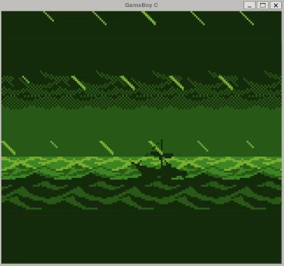
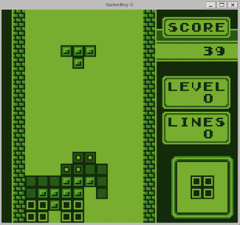

# GameBoy C
&emsp; &emsp; &emsp; &emsp; &emsp; &emsp; &emsp; &emsp; &emsp; &emsp; &emsp;


## Table of Contents
- [Gameboy C Emulator](#gameboy-c-emulator)
- [Features](#features)
- [Controls](#controls)
- [Installation (Compilation and Running)](#installation-compilation-and-running)
- [References](#references)
- [Dependencies](#dependencies)
- [Dependency Installation](#dependency-installation)
- [CPU Speed](#cpu-speed)
- [License](#license)

## Gameboy C Emulator
An implementation of a GameBoy (DMG) and a GameBoy Color (GBC) written
using the C programming language with SDL2 as the window system

## Features
* Original GameBoy Gameplay
* GameBoy Color Gameplay
* Audio
* Optional Controller Input

## Controls
* A - A button
* B - B button
* Enter - Start button
* Left OR Right Shift - Select button
* Arrow Keys - D-Pad
* ESC - Quit emulator

## Installation (Compilation and Running)
* change directory to the 'src' folder of the project, then running the following commands:

```sh
make
./gameboy_c ../roms/<ROM_FILE_NAME>
```

* IMPORTANT: Only runs on Linux Operating System Distributions
* IMPORTANT: Ensure the ROM you wish to load is in the 'roms' folder of this project
* IMPORTANT: Will work with both GameBoy and GameBoy Color ROMs

<br>

 

## References
- https://gbdev.io/pandocs/
- https://www.pastraiser.com/cpu/gameboy/gameboy_opcodes.html
- [Game Boy (LR35902) OP Codes](docs/Game%20Boy%20(LR35902)%20OP%20Codes.html)
- [Game Boy Complete Technical Refercence](docs/Game%20Boy%20Complete%20Technical%20Reference.pdf)
- [The Cycle-Accurate Game Boy Docs](docs/The%20Cycle-Accurate%20Game%20Boy%20Docs.pdf)

## Dependencies
* SDL2
* libpthread

## Dependency Installation
* Debian Linux Distributions (e.g. Ubuntu):
	- install SDL2 kit, SDL2 ttf and build-essential using commands: 

```sh
sudo apt install libsdl2-dev
sudo apt install libsdl2-ttf-dev
sudo apt install build-essential
```

## CPU Speed
Using line 33 in emulator.h, the CPU speed can be increased 
to allow for faster gameplayby increasing 1U (default speed)
to 2U (double speed), 3U (triple speed) etc.

## License
Eliseo Copyright 2023
<br>
Code released under the [MIT License](LICENSE)
<br>
Sample gameplay images are taken from licensed Nintendo 
and GameFreak GameBoy and GameBoy Color cartridges
